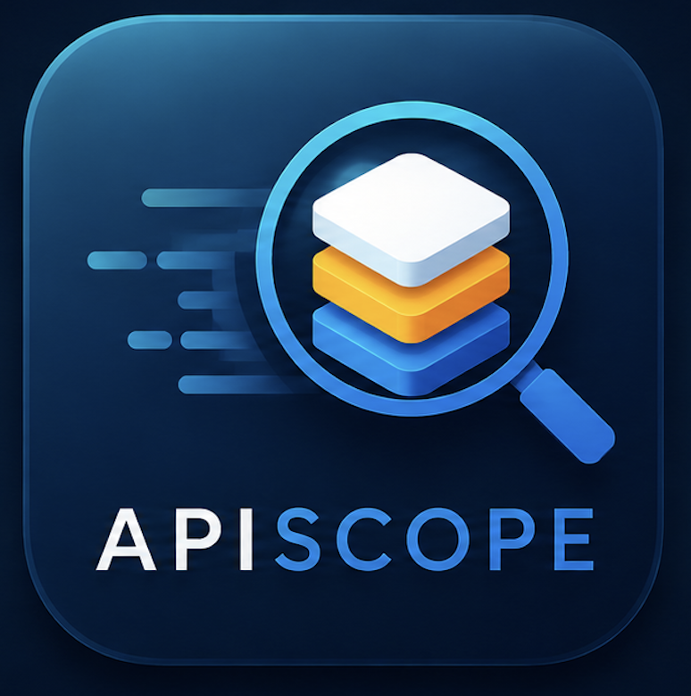
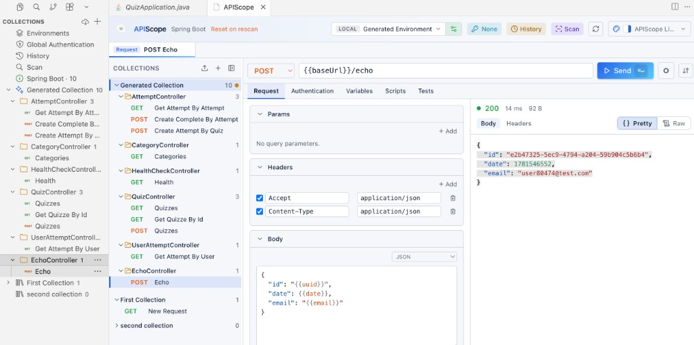
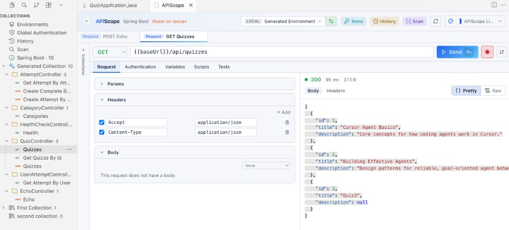
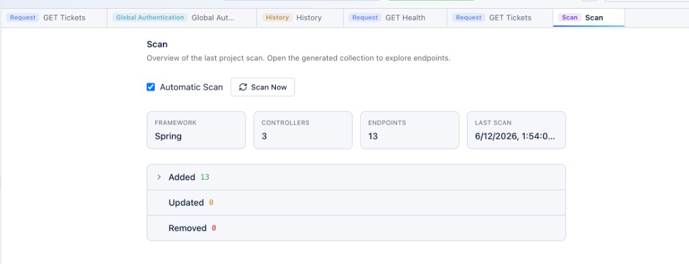
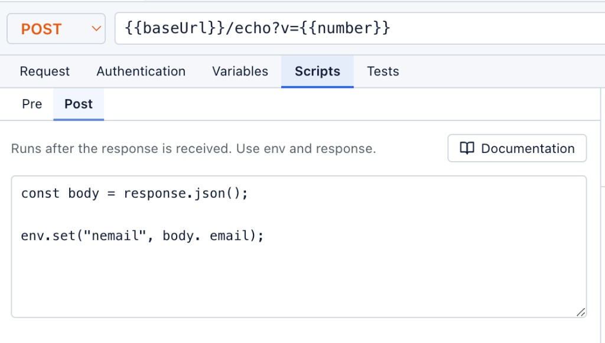

# APIScope for Cursor

<p align="center">
  
</p>

APIScope is a source-code-aware API client for VS Code and Cursor. It discovers REST endpoints from application source code, generates collections automatically, and supports browser-like authentication — without Swagger or OpenAPI files.

**Documentation:** [getapiscope.com](https://getapiscope.com)

## See it in action

The main panel combines a collections tree, request editor, and response viewer in one place:



The **Collections** sidebar gives quick access to scanned endpoints, environments, authentication, history, and scan. Requests show color-coded HTTP method badges; generated collections use a sparkle icon:



Scan your workspace to discover endpoints grouped by controller or router:



Send requests with headers, body, scripts, and response tests:



## Features

- **Spring Boot, Express, FastAPI scanners** — no Swagger/OpenAPI required
- **Generated Collection** — auto-populated from source, grouped by controller/router
- **User collections** — create, import, export; never touched by rescans
- **Environments** — `{{baseUrl}}` variables with tier badges (LOCAL, DEV, PROD, …)
- **Session login** — form login with cookie capture; secrets in VS Code Secret Storage
- **Request editor** — headers, JSON/multipart body, scripts, response tests
- **History & drafts** — replay past executions; ad-hoc draft tabs
- **File downloads** — binary response preview and persistence

## Supported frameworks

| Framework | Detection | Base URL |
|-----------|-----------|----------|
| Spring Boot | `@RestController`, `@GetMapping`, … | `server.port` from `application.properties` / `.yml` |
| Express (Node.js) | Route definitions in JS/TS | Port from `process.env.PORT` or app listen call |
| FastAPI (Python) | `@app.get`, router decorators | Uvicorn / app config |

## Quick start

1. Install APIScope from the [VS Code Marketplace](https://marketplace.visualstudio.com/) or [Open VSX](https://open-vsx.org/).
2. Open a project that contains a supported framework.
3. Click the **APIScope** icon in the activity bar, then run **Scan Endpoints**.
4. Select a request from the **Generated Collection** and press **Send** (`⌘↵` on macOS, `Ctrl+Enter` on Windows/Linux).

See the [Getting Started guide](https://getapiscope.com/guide/getting-started) for a full walkthrough, including sample projects.

## Commands

| Command | Description |
|---------|-------------|
| `APIScope: Open APIScope` | Open the main panel |
| `APIScope: Scan Endpoints` | Scan workspace and refresh collections |
| `APIScope: Session Login` | Form login and cookie capture |

Full list: [getapiscope.com/guide/commands](https://getapiscope.com/guide/commands)

## Workspace data

APIScope stores collections, environments, history, and scans in a portable `.apiscope/` directory beside your project:

```text
.apiscope/
├── config.json
├── collections/
├── environments/
├── scans/
├── history/
├── drafts/
└── downloads/
```

See the [Workspace Specification](https://getapiscope.com/specification/workspace/v1/) for details.

## Documentation

- [User guide](https://getapiscope.com/guide/getting-started) — install, scan, send requests, authenticate
- [Specifications](https://getapiscope.com/specification/) — `.apiscope/` workspace and history formats

## Development

To build from source, run the docs site locally, or explore the architecture, see [DEVELOPMENT.md](DEVELOPMENT.md).

## License

Apache-2.0
